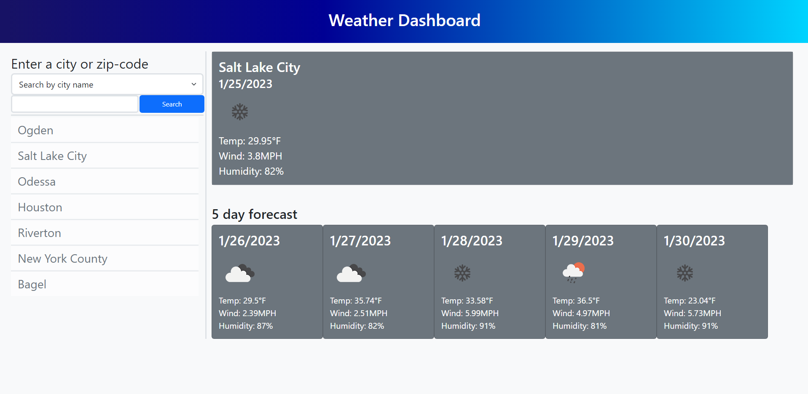

# Weather-Dashboard
## Description

A weather dashboard that will display current weather conditions, and a 5 day forecast.

## Installation

Nothing special is needed to install. It's just an HTML, CSS, Javascript, and some picture assets. Uses jQuery and bootstrap, but no need to instal because it uses CDN.

## Usage

You can view the published webpage [here](https://spawze.github.io/Weather-Dashboard/)  

Select your search type, either by city name, or zip code, then enter your search. If it has a match, all of the weather info will automatically display.
Once a successful search is made, it will get added to the search history section, where you can bring up old search results.

## Credits

N/A

## License

MIT License

Please See License file in the repository.
